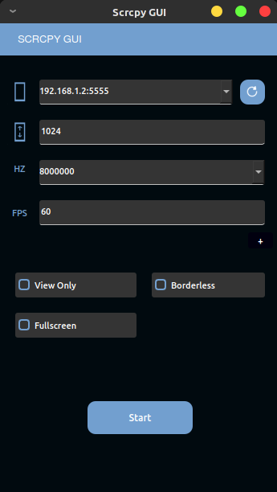

# Scrcpy GUI

Uma interfáce de usuário simples em PyQt5 para scrcpy


## Atenção
Os testes ocorreram apenas no Lubuntu 20.04. Pode não ser compatível com outras distribuições Linux ou Sistemas Operacionais, mas estarei tratando disso em alguns dias.

### Requisitos

Alguns pacotes como PyQt5, adb, scrcpy, python3 são necessários para que tudo funcione

Você pode instalá-los em seu PC usando os seguintes comandos:

```
# apt-get install snapd python3 python3-pip adb
# snap install scrcpy
$ pip3 install PyQt5
```


### Instalação
Para instalar o programa, basta rodar o script "installer_uninstaller.py"

```sh
$ python3 install_uninstall.py
```

### Desinstalação
Para desinstalar, basta rodar o mesmo script de instalação

```sh
$ python3 install_uninstall.py

Already installed in $HOME/.local/share/hayukiApps/scrcpy_gui/, uninstall? (Y/n)
```


## Uso
Para executar o programa, pode utilizar o ícone que é criado no menu ou executar direto do terminal com
```
$ scrcpy_gui
```


