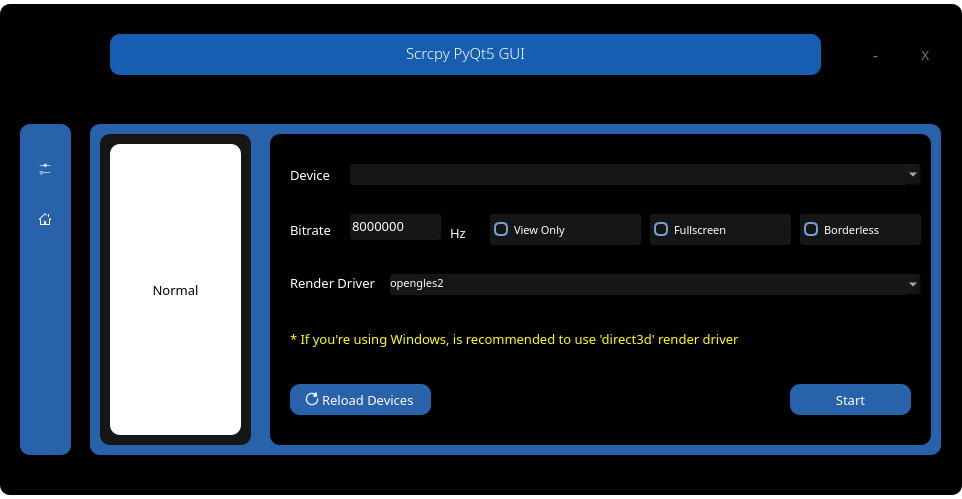

# Scrcpy GUI
Uma interface em Qt5 para scrcpy;



## Pacotes, programas e instalação
Alguns pacotes são necessários para o funcionamento de programa, e podem ser instalados com os seguintes comandos:


#### Ubuntu/Debian

```sh
$ sudo apt-get install snapd python3-pip adb
$ sudo snap isntall scrcpy
$ pip3 install PyQt5 pure-python-adb
```


#### Arch/Manjaro
(NOTA: Tanto PARU quanto YAY pode ser utilizado neste processo, caso tenha algum dos dois instalado. Neste caso, estarei utilizando Paru como exemplo)

```sh
$ yay -S python3 python3-pip scrcpy
$ sudo pacman -S android-tools
$ pip3 install PyQt5 pure-python-adb
```


### Instalação

#### Linux
Para fazer a instalação em distros linux, basta rodar o script `install_uninstall.py` e seguir os passos.
Deixo avisado que a instalação desta versão ocorrerá num diretório diferente. Ficará no `/home/{seu_usuário}/.local/share/HayukiApps/`

Aviso aqui também que os comandos _devem_ ser executados dentro da pasta;
```sh
$ python install_uninstall.py
```

#### Windows
Infelizmente o instalador ainda não está pronto para o Windows, estarei desenvolvendo em breve. Mas creio que o programa funcione bem se estiver com todas as dependências e se `adb.exe` e `scrcpy.exe` estiverem no PATH do Windows


## Uso
Para lançar o programa, pode utilizar o ícone que é criado após a instalação (linux), ou iniciar através do terminal pelo seguinte comando;

```sh
$ scrcpy_gui
```


## Solução de problemas

Caso `scrcpy_gui` não inicie pelo terminal, verifique se `/home/usuario/.local/bin` está em $PATH, você pode verificar com `$ echo $PATH`

#### Bash padrão
Caso o path não esteja, você pode adicionar ao "~/.bashrc" a seguinte linha no final do arquivo
```sh
export PATH=$PATH:/home/{seu usuario}/.local/bin
```

#### Fish
Se você estiver utilizando o `fish`, o caso é outro
Você pode adicionar o path da seguinte forma:


No seu editor de texto preferido, adicione a seguinte linha no arquivo `~/.config/fish/config.fish`
```sh
set -U fish_user_paths /home/{seu usuário}/.local/bin $fish_user_paths
```

## Outros problemas
Caso seu problema não seja o de cima, você pode abrir uma issue.
